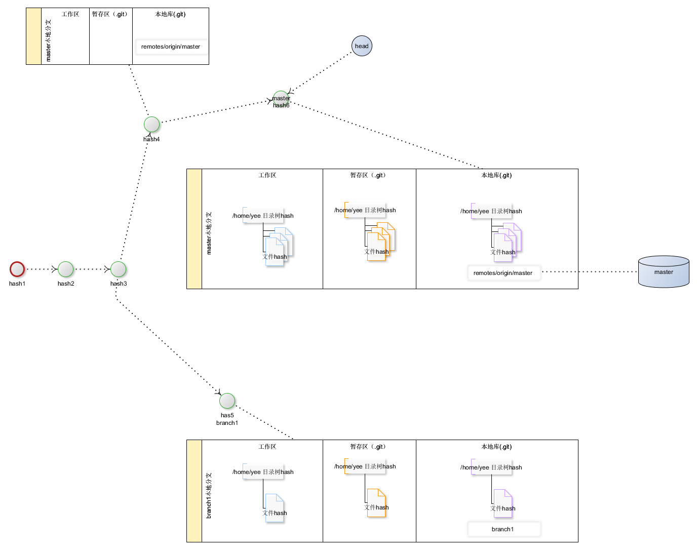

# about-git
##先从一张图开始...

- git是一种围绕文件系统（用hash代表文件系统及提交）及其构建的树形结构，来跟踪和管理变更的版本控制系统；
- git中包含工作区、暂存区、版本区、本地分支、远程分支、远程库等概念，同时提供了丰富的命令来操作这些概念；
- git中保存着每次提交记录，每个提交由提交hash来表示，所有的提交hash构成一棵树；
- git中每个提交hash下面挂接着文件系统，文件系统包含目录树hash及文件hash，每个hash唯一标识目录树及文件；
