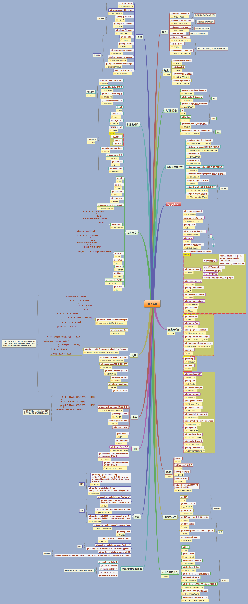

# about-git
##先从一张图开始...

- git是一种围绕文件系统（用hash代表文件系统及提交）及其构建的树形结构，来跟踪和管理变更的版本控制系统；
- git中包含工作区、暂存区、版本区、本地分支、远程分支、远程库等实体，同时提供了丰富的命令来操作这些实体；
- git中保存着每次提交记录，每个提交由提交hash来表示，所有的提交hash构成一棵树；
- git中每个提交hash下面挂接着文件系统，文件系统包含目录树hash及文件hash，每个hash唯一标识目录树及文件；

##git核心思想
1. 文件系统差异及如何解决？覆盖，自动合并、冲突
2. 文件系统同步方向

###工作区<->暂存区

###暂存区<->版本区

###本地仓库各分支

###本地仓库<->远程仓库

###常用命令
####显示状态
- git cat-file
	
	git中比较底层的命令，用于查看hash对象的类型、内容等信息，通过这个命令，我们可以查看提交hash、版本库文件系统及文件的挂接联系，进一步了解git的内部原理
	
	- git cat-file -t hash #显示hash对象类型：提交hash为commit、文件hash为blob、目录树hash为tree
	
	- git cat-file -p hash #显示hash对象的内容
	
 

- git log
	
	显示当前分支按时间排序的提交函数	

- git show

- git ls-tree 任意的提交hash

	显示版本库的文件系统，每个提交hash下面挂载着版本库的文件系统

- git ls-files

	显示暂存区的文件系统 

##git命令思维导图

